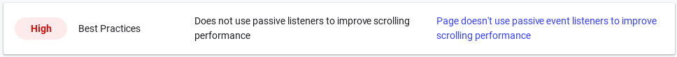

# Override of `addEventListener` to apply passive event listeners

A native override for events `wheel`, `mousewheel`, `touchstart`, `touchmove` that enables to pass the Google Lighthouse penalty `Does not use passive listeners to improve scrolling performance`.

Include `passive-fix.js` before jQuery or code that uses `addEventListener`.

More info:

* https://developers.google.com/web/tools/lighthouse/audits/passive-event-listeners
* https://web.dev/uses-passive-event-listeners/

Passive event handlers are planned for jQuery 4:

https://github.com/jquery/jquery/issues/2871